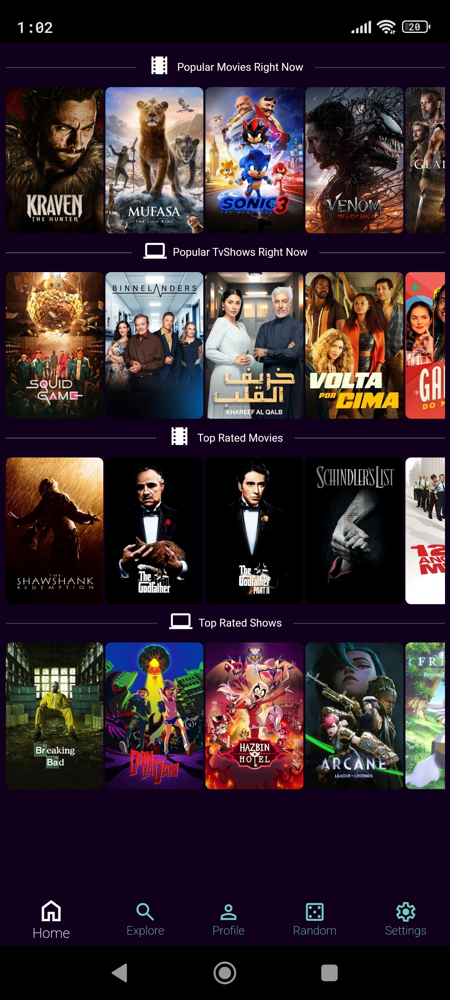
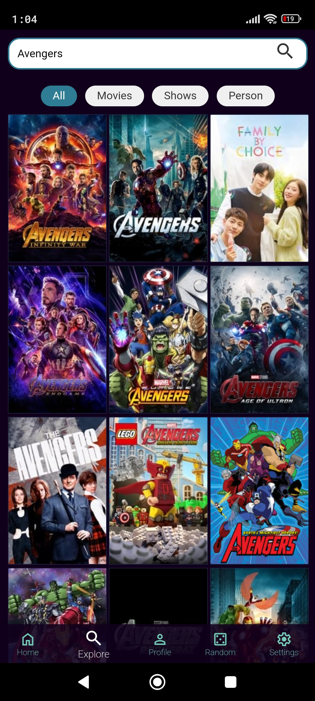
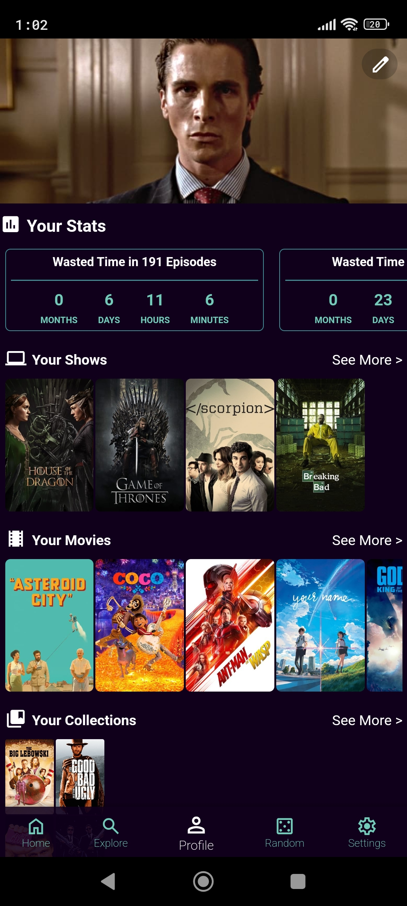
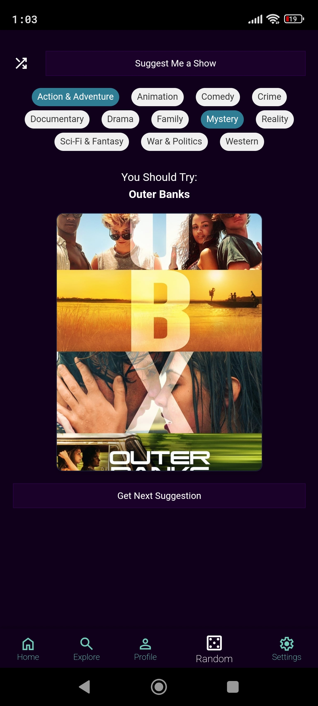
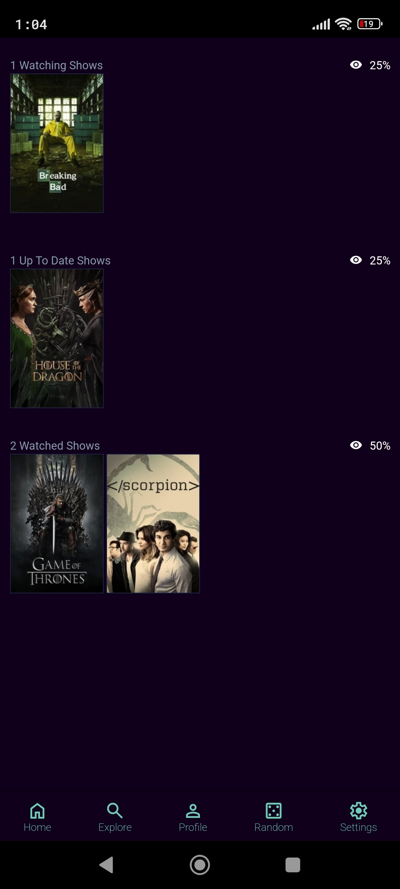
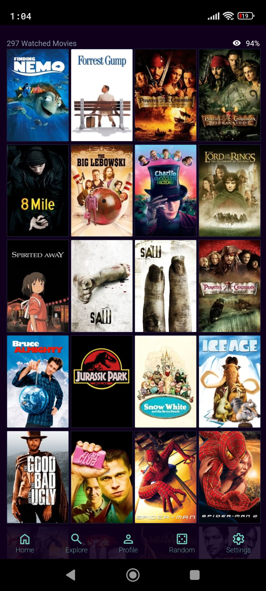
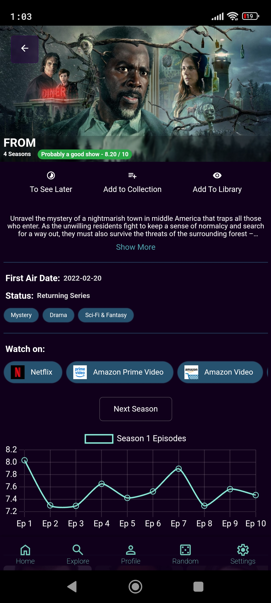
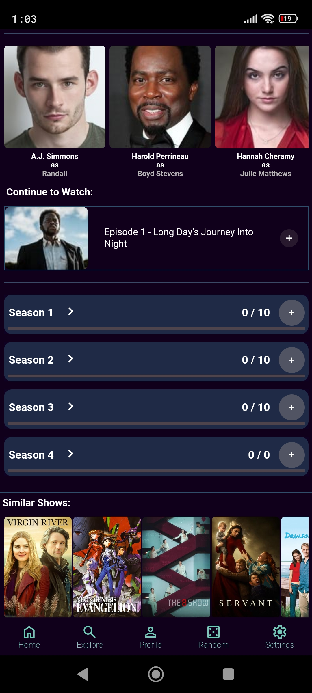
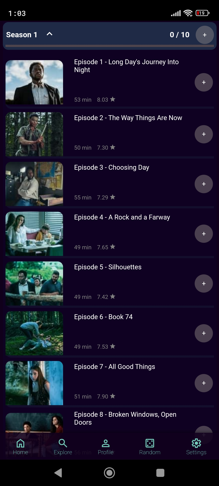
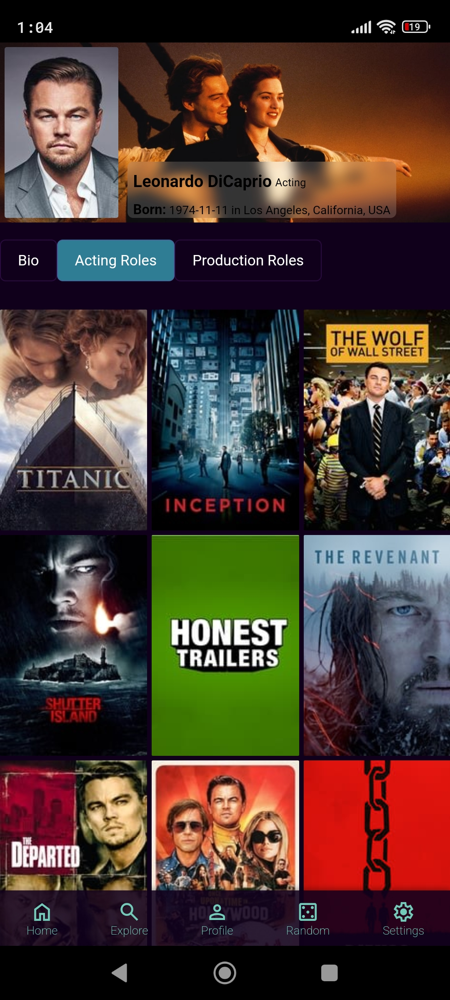

# Watchlist Wizard - Personal App to easily track favorite movies and shows!

This app was created  with [Angular CLI](https://angular.dev) for the Front-End and "Back-end", with [Capacitor](https://capacitorjs.com) to transform it into an android App and [The Movie Database](https://www.themoviedb.org) for API.


# Features 
- Search for movies, shows and people;
- Mark Movies and Shows/Episodes as watched;
- Create collections;
- Random suggestion based on what I want to watch;
- Inform how much time I wasted watching the movies and shows;
- Import movies from [TvTime](https://www.tvtime.com);
- Customize profile banner based on what movies/shows you have in your collection;


# Screenshots


<div align="center">
    <h2>Home</h2>
    
</div>

<div align="center">
    <h2>Search</h2>
    
</div>


<div align="center">
    <h2>Profile</h2>
    
</div>


<div align="center">
    <h2>Random Suggestion</h2>
    
</div>

<div align="center">
    <h2>All Shows And Movies</h2>
    
    
</div>

<div align="center">
    <h2>Movies/Shows Details</h2>
    
    
    
</p

<div align="center">
    <h2>Person Details</h2>
    
</div>


# Setup on Your Machine

To set up the project on your machine, follow these steps:

1. Clone the repository:
    ```bash
    git clone https://github.com/JoaoMaio/WatchList-Wizard.git
    ```

2. Navigate to the project directory:
    ```bash
    cd WatchlistWizard
    ```

3. Install the dependencies:
    ```bash
    npm install
    ```

4. Add Android platform:
    ```bash
    npx cap add android
    ```

5. Create a environment.ts file with this:
    ```ts
    export const environment = {
    imgPath: 'https://image.tmdb.org/t/p/w154/',
    backdropPath: 'https://image.tmdb.org/t/p/w1280',
    API_KEY : 'your-api-key',
    BASE_API_URL : 'https://api.themoviedb.org/3/',
    headers: {
        'Content-Type': 'application/json',
        'Authorization': "Bearer your-bearer-token"
        },
    bannerDefault: 'banner.jpg',
    }
    ```

6. Run the application:
    ```bash
    ng serve
    ```

7. Open your browser and go to `http://localhost:4200/` to see the app in action;

8. Some Parts of the App don't work on the browser because, they need the database, which only exists in the Android App.

# Build the App

1. Build the App:
    ```bash
    npm run build  
    ```

2. Sync the Files:
    ```bash
    npx cap sync
    ```

3. Open Android platform:
    ```bash
    npx cap open android
    ```


## License

This project is licensed under the [Creative Commons Attribution-NonCommercial 4.0 International (CC BY-NC 4.0)](https://creativecommons.org/licenses/by-nc/4.0/).  
You may use, share, and adapt this project for non-commercial purposes, but you must provide appropriate attribution.
